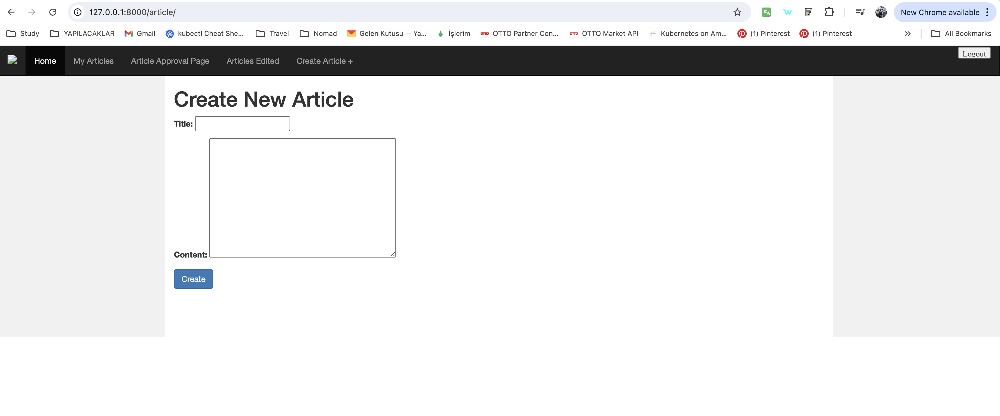

Toy Project
================


Installation
================

- Create a virtualenv and activate it

```shell
python -m venv venv-ppc
source venv-ppc/bin/activate
```

- Install requirement files to venv

```shell
pip install -r requirements.txt
```

- Run the migration
```shell
python manage.py migrate
```

- Load test data
```shell
python manage.py loadtestdata
```

Installation With Docker
=================
> Make sure you have Docker on your computer https://www.docker.com/get-started/
> Same thing for docker compose (I used home brew to install on my local)


- Copy .env-example file as .env and fill parameters

```shell
cp .env-example .env
```

- Run docker-compose and build all services
```shell
docker compose up --build
```

- Enjoy


### 1- Home page


### 2- Approval page


### 3- Articles Edited page


### 4- Articles Create page


