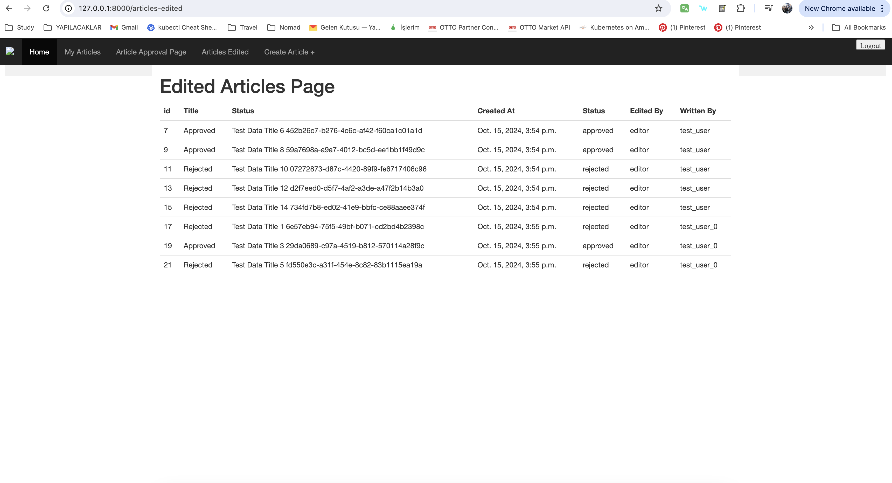

Toy Project
================


Installation
================

- Create a virtualenv and activate it

```shell
python -m venv venv-ppc
source venv-ppc/bin/activate
```

- Install requirement files to venv

```shell
pip install -r requirements.txt
```

- Run the migration
```shell
python manage.py migrate
```

- Load test data
```shell
python manage.py loadtestdata
```


### 1- Home page


### 2- Approval page


### 3- Articles Edited page



